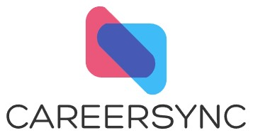
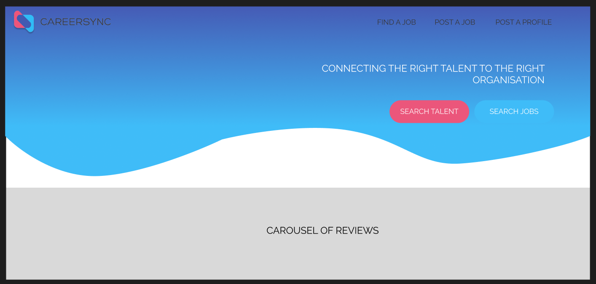
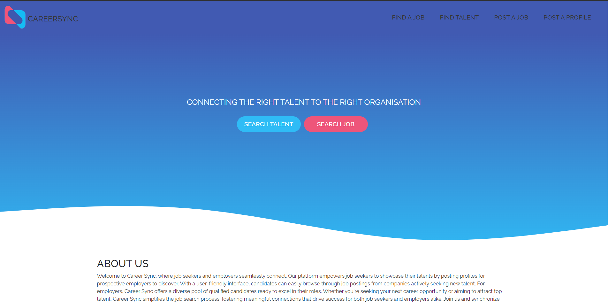

# Career Sync

  

Welcome to Career Sync, where job seekers and employers seamlessly connect.

  ## Description
  Career Sync is your gateway to seamless connections in the job market. Tailored for both job seekers and employers, our platform offers intuitive features for effortless networking. Job seekers can showcase their talents with detailed profiles, while employers can access a diverse pool of qualified candidates. With user-friendly interfaces facilitating job postings and searches, Career Sync streamlines the recruitment process. Join us today to unlock opportunities, cultivate meaningful connections, and propel your career journey forward.

  ### Features
  * Post A Job: Employers can easily post job listings, reaching a wide pool of talented candidates.
  * Post A Profile: Job seekers have the opportunity to create detailed profiles showcasing their skills and experiences for employers to discover.
  * Find A Job: Candidates can efficiently browse through a variety of job postings from companies actively seeking new talent.
  * Find A Profile: Employers gain access to a diverse pool of qualified candidates, simplifying the process of finding the perfect fit for their job openings.
  
  ### Technologies Used
  * React: The core framework driving the frontend development, allowing for the creation of reusable components and efficient state management.
  * React Router: Facilitates client-side routing, enabling seamless navigation between different sections of the portfolio site.
  * HTML5 & CSS3: The backbone of the site's structure and styling, ensuring a visually appealing and user-friendly interface.
  * JavaScript (ES6+): Leveraged for implementing dynamic functionality and enhancing user interaction.
  * Bootstrap: Utilized for additional styling and layout components, enhancing the overall aesthetic and responsiveness of the site.
  * Figma: Wireframing.
  * AppWrite: The Backend as a Service used to host the database to POST and GET data to and from, providing the main functionality for our site.
  * Styled Components: Stress free styling, used primarily for pages located in the pages folder, to negate the need for individual page styling files.
  * React-Hot-Toast: Modern and stylised popups, used to provide feedback to the user based on their interactions with the site.

  ### Figma
  Using Figma, we were able to wireframe out our design ideas. Providing our design team with a template to build the foundations for our site.

  

  
  

  ### Home Page

  

  
  

  ## Table of Contents
  * [Installation](#Installation)
  * [Contributors](#Contributors)
  * [Credits](#Credits)
  * [Testing](#Test)
  * [License](#lLicense)
  
  ## Installation

  ### Prerequisites:
  Node.js and npm (Node Package Manager) should be installed. You can download and install them from the official Node.js website.

  * Clone Repository: git clone https://github.com/sunielmudhar/CareerSync
  * Navigate to Directory: cd CareerSync
  * Install Dependencies: npm install or npm i
  * Run Development Server: npm run dev
  * Visit Site: Open your browser and navigate to http://localhost:5173/
  
  ## Contributors

  * [Sunny Mudhar](https://github.com/sunnymudhar/)
  * [Irtiza Safdar](https://github.com/irtiza-S/)
  * [Sing Lung Louie](https://github.com/Louie888A/)

  ## Credits
  Following tools were used inorder to create this project: 

  * [Vite](https://vitejs.dev/) - Create the React project.
  * [AppWrite](https://appwrite.io/) - Backend as a Service.
  * [AppWrite SDK](https://www.npmjs.com/package/appwrite/) - SDK for interacting with Backend.
  * [Styled-Components](https://www.npmjs.com/package/styled-components/) - Simplified CSS styling.
  * [React-Hot-Toast](https://www.npmjs.com/package/react-hot-toast/) - Pop Alert Creation.
  * [GetWaves](https://getwaves.io/) - Wave Generation.
  * [Bootstrap](https://getbootstrap.com/docs/5.0/getting-started/introduction/) - For CSS styling components.
  * [React-router-dom](https://reactrouter.com/en/main) - Dynamic linking and navigation for React.

  ## Testing
  To test the application, please go to the Netlify link found at the bottom of the README to start navigating through the portfolio. Likewise, you can deploy the repo locally using the installation instructions provided.

  ## Deployment
  [Netlify](https://career-sync.netlify.app/)

  ## License
  Licensed under MIT.

